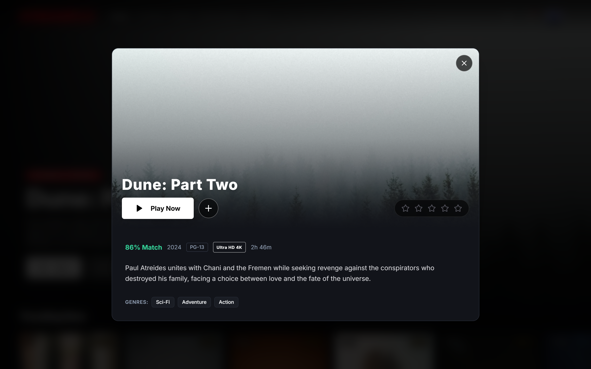
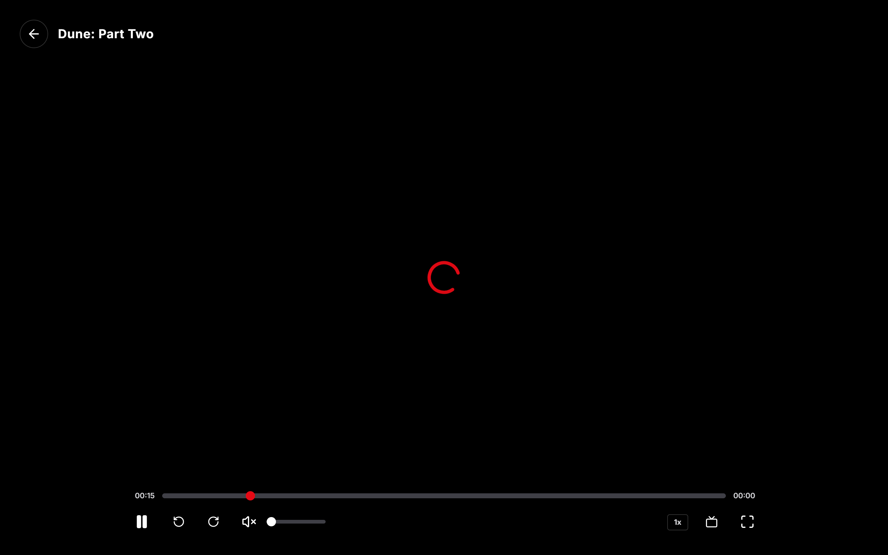
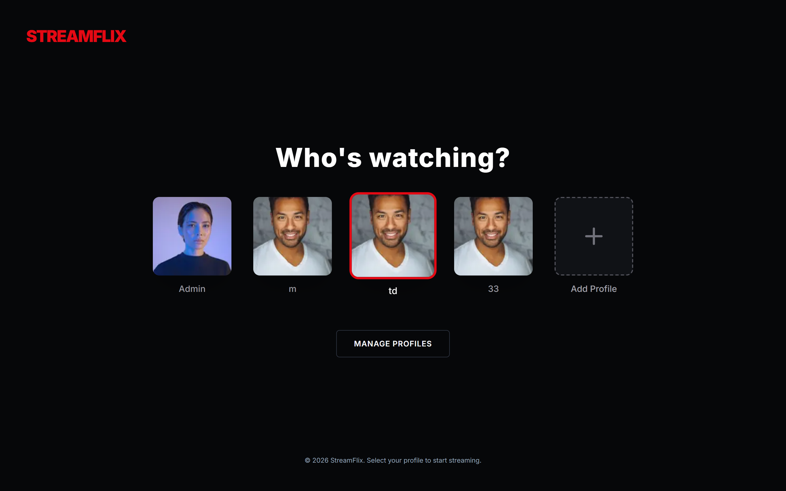
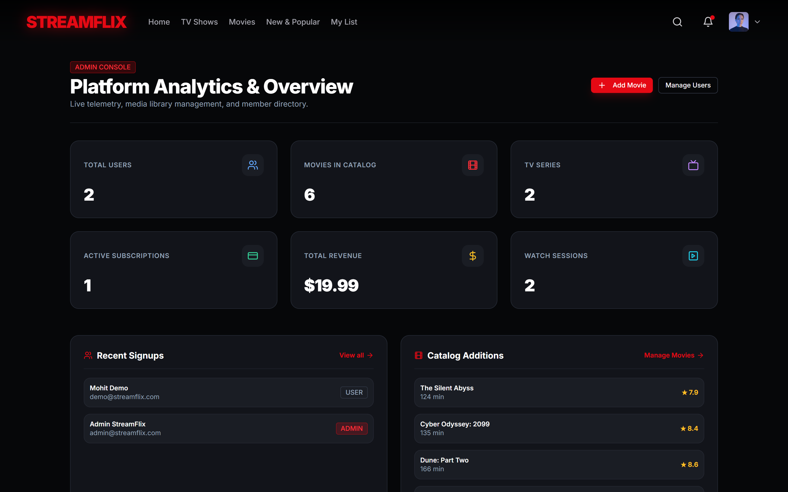

# StreamFlix - Modern Full-Stack Streaming Platform

StreamFlix is a production-quality, Netflix-inspired full-stack video streaming application built from the ground up with **Next.js App Router**, **TypeScript**, **Tailwind CSS**, **Prisma ORM**, **NextAuth.js**, and **Stripe**.

---

## 📸 Screenshots

| **Movie Details & Interactive Ratings** | **Custom HTML5 Video Player** |
| :---: | :---: |
|  |  |
| **Multi-Profile Selection** | **Admin Management Dashboard** |
|  |  |

---

## ✨ Features

- **Cinematic Dark UI/UX**: Custom branding, responsive glassmorphic navbar, hero video preview, and horizontal carousels.
- **Full Authentication**: Email/password credentials authentication with bcrypt password hashing, session management, and optional Google OAuth.
- **Multi-Profile System**: Netflix-style "Who's watching?" profile selection, avatar customization, kids profile safety mode, and profile switching.
- **Extensive Media Catalog**: Real metadata with TMDB API integration and built-in curated 4K fallback titles.
- **Custom HTML5 Video Player**:
  - Full-screen & Picture-in-Picture support
  - 10s skip forward/backward & timeline scrubbing
  - Playback speed adjustment (0.5x to 2x)
  - Real-time periodic watch progress tracking & auto-resume capability.
- **Continue Watching & Watch History**: Live progress synchronization to SQLite/PostgreSQL with percentage indicators.
- **Personalized Watchlist**: Add/remove movies and TV shows with instant optimistic updates.
- **5-Star Interactive Rating**: Rate movies and TV shows per profile with duplicate prevention.
- **Dynamic Recommendation Engine**: Content affinities tailored by genre frequency and watch history.
- **Stripe Subscriptions**: Tiered subscription plans (Basic, Standard, Premium) with Stripe Checkout, webhooks, and seamless local dev simulation.
- **Admin Management Console**: Role-protected (`role=ADMIN`) dashboard with live KPI analytics, user role promotion/demotion, and movie CRUD operations.
- **Fully Responsive**: Optimized for 4K desktop, laptop, tablet, and mobile touch interactions.

---

## 🛠️ Technology Stack

- **Framework**: [Next.js 14](https://nextjs.org/) (App Router, Server Components & Route Handlers)
- **Language**: [TypeScript](https://www.typescriptlang.org/)
- **Styling**: [Tailwind CSS](https://tailwindcss.com/) & [Lucide Icons](https://lucide.dev/)
- **Database & ORM**: [Prisma ORM](https://www.prisma.io/) with SQLite (local) / PostgreSQL (production)
- **Authentication**: [NextAuth.js](https://next-auth.js.org/) (Auth.js) with JWT sessions
- **Validation**: [Zod](https://zod.dev/)
- **State Management**: [Zustand](https://github.com/pmndrs/zustand)
- **Billing**: [Stripe](https://stripe.com/)
- **Testing**: [Vitest](https://vitest.dev/)

---

## 🚀 Getting Started

### 1. Prerequisites
- Node.js `18.x` or higher (`v20+` recommended)
- npm or yarn

### 2. Installation
Clone the repository and install dependencies:
```bash
git clone https://github.com/your-username/streamflix.git
cd streamflix
npm install
```

### 3. Environment Variables
Copy the example environment file:
```bash
cp .env.example .env
```

Default local `.env` configuration:
```env
DATABASE_URL="file:./dev.db"
NEXTAUTH_SECRET="streamflix-development-secret-key-32-chars-long"
NEXTAUTH_URL="http://localhost:3000"
AUTH_SECRET="streamflix-development-secret-key-32-chars-long"
NEXT_PUBLIC_APP_URL="http://localhost:3000"
VIDEO_PROVIDER="demo"
DEFAULT_VIDEO_URL="https://commondatastorage.googleapis.com/gtv-videos-bucket/sample/BigBuckBunny.mp4"
```

### 4. Database Initialization & Seeding
Generate the Prisma Client, push the database schema, and seed the demo data:
```bash
npx prisma generate
npx prisma db push
npm run prisma:seed
```

### 5. Running the Application
Start the development server:
```bash
npm run dev
```
Open [http://localhost:3000](http://localhost:3000) in your browser.

---

## 🔑 Pre-Seeded Accounts

| Role | Email | Password |
| :--- | :--- | :--- |
| **Admin** | `admin@streamflix.com` | `AdminPass123!` |
| **Demo User** | `demo@streamflix.com` | `DemoPass123!` |

---

## 🧪 Testing

Run the Vitest unit and integration test suite:
```bash
npm run test
```

---

## 🏗️ Production Build

Verify the production build:
```bash
npm run build
```

---

## 📂 Project Structure

```
├── app/
│   ├── (auth)/
│   │   ├── login/
│   │   ├── register/
│   │   └── forgot-password/
│   ├── browse/
│   ├── movies/
│   │   └── [id]/
│   ├── series/
│   │   └── [id]/
│   ├── watch/
│   │   └── [id]/
│   ├── search/
│   ├── my-list/
│   ├── profiles/
│   ├── account/
│   ├── subscription/
│   ├── admin/
│   │   ├── dashboard/
│   │   ├── movies/
│   │   └── users/
│   └── api/
│       ├── auth/
│       ├── movies/
│       ├── series/
│       ├── search/
│       ├── watchlist/
│       ├── history/
│       ├── ratings/
│       ├── recommendations/
│       ├── profiles/
│       ├── payments/
│       └── admin/
├── components/
│   ├── navbar/
│   ├── hero/
│   ├── movie-card/
│   ├── movie-row/
│   ├── movie-grid/
│   ├── video-player/
│   ├── profile-selector/
│   ├── rating/
│   ├── modal/
│   └── ui/
├── lib/
│   ├── prisma.ts
│   ├── auth.ts
│   ├── tmdb.ts
│   ├── stripe.ts
│   └── utils.ts
├── prisma/
│   ├── schema.prisma
│   └── seed.ts
├── store/
├── types/
└── tests/
```

---

## 🔒 Security

- **Password Hashing**: Bcrypt with 10 salt rounds.
- **Route Guarding**: NextAuth middleware protecting `/browse`, `/movies`, `/series`, `/watch`, `/my-list`, `/profiles`, `/account`, `/subscription`, and `/admin`.
- **Role-Based Access Control**: Server-side session verification requiring `role=ADMIN` for all administrative operations.
- **Input Sanitization**: Zod validation schemas across all mutation endpoints.

---

## 📄 License

This project is licensed under the MIT License.
